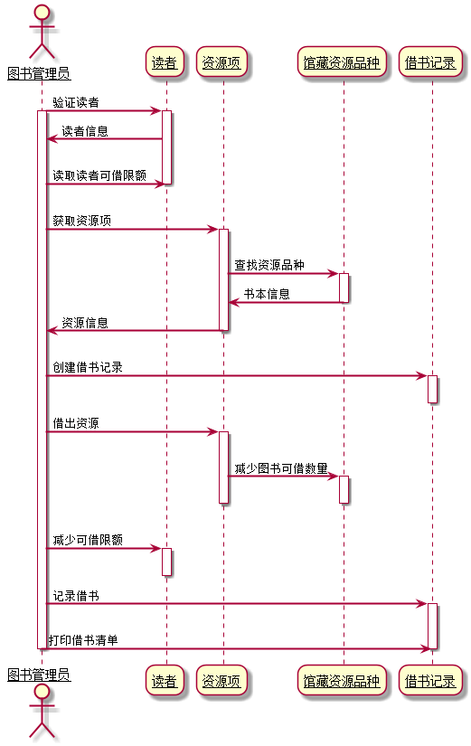
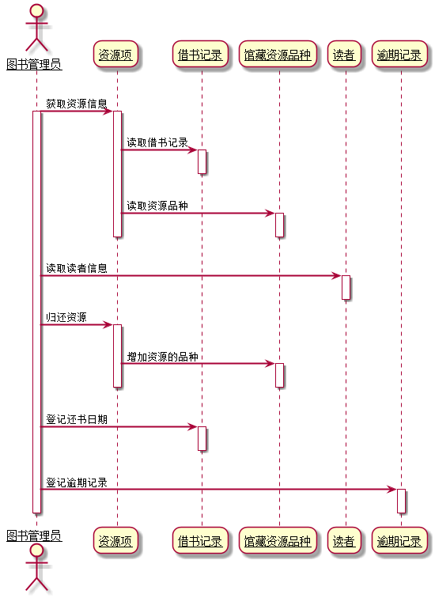

# 实验四：图书管理系统顺序图绘制
| 学号 | 班级 | 姓名 | 照片|
|:----:|:-----:|:----:|:----:|
| 201510414320 | 软件（本）15-3 | 谢超 |  |

## 图书管理系统的顺序图
### 1.借书用例
#### 1.1.借书用例PlantUML
    @startuml
    skinparam sequenceArrowThickness 2
    skinparam roundcorner 20
    skinparam maxmessagesize 60
    skinparam sequenceParticipant underline
    
    actor 图书管理员 as a
    participant "读者" as b
    participant "资源项" as c
    participant "馆藏资源品种" as d
    participant "借书记录" as e
    
    a ->b:验证读者
    activate a
    activate b
    b->a:读者信息
    a->b:读取读者可借限额
    deactivate b
    a->c:获取资源项
    activate c
    c->d:查找资源品种
    activate d
    d->c:书本信息
    deactivate d
    c->a:资源信息
    deactivate c
    a->e:创建借书记录
    activate e
    deactivate e
    a->c:借出资源
    activate c
    c->d:减少图书可借数量
    activate d
    deactivate d
    deactivate c
    a->b:减少可借限额
    activate b
    deactivate b
    a->e:记录借书
    activate e
    a->e:打印借书清单
    deactivate e
    deactivate a
    @enduml
#### 1.2.借书用例顺序图

#### 1.3.借书用例顺序图说明
借书用例顺序图为图书管理员先验证读者信息，然后获取读者借书限额，通过借书限额次数判断是否可借，然后图书管理员再获取图书信息，创建借书记录，记录下读者借书时间，图书信息等，借给读者后减少该图书可借数量，并减少读者可借限额次数，最后打印借书清单。
### 2.还书用例
#### 2.1.还书用例PlantUML
    @startuml
    skinparam sequenceArrowThickness 2
    skinparam roundcorner 20
    skinparam maxmessagesize 60
    skinparam sequenceParticipant underline
    
    actor 图书管理员 as a 
    participant 资源项 as b
    participant 借书记录 as c
    participant 馆藏资源品种 as d
    participant 读者 as e
    participant 逾期记录 as f
    
    a -> b:获取资源信息
    activate a
    activate b
    b->c:读取借书记录
    activate c
    deactivate c
    b->d:读取资源品种
    activate d
    deactivate d
    deactivate b
    a->e:读取读者信息
    activate e
    deactivate e
    a->b:归还资源
    activate b
    b->d:增加资源的品种
    activate d
    deactivate d
    deactivate b
    a->c:登记还书日期
    activate c
    deactivate c
    a->f:登记逾期记录
    activate f
    deactivate f
    deactivate a
    @enduml
#### 2.2.还书用例顺序图

#### 2.3.还书用例顺序图说明
还书用例顺序图为图书管理员首先读取图书信息，通过读书信息去获取借书记录，再去获取资源的品种，然后图书管理员在读取借阅者的信息
再归还图书，增加图书可借数量，最后登记还书日期及登记逾期记录进行扣费。