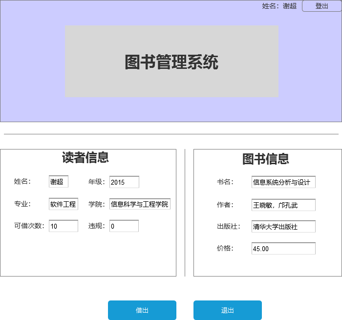

# 实验五：图书管理系统数据库设计与界面设计
| 学号 | 班级 | 姓名 | 照片|
|:----:|:-----:|:----:|:----:|
| 201510414320 | 软件（本）15-3 | 谢超 |  |
## 1.数据库设计
### 1.1.图书表
|字段|类型|长度|主键,外键|可否为空|默认值|约束|说明|
|:----:|:-----:|:----:|:----:|:----:|:-----:|:----:|:----:|
|ISBN|varchar|13|主键|否||||
|bookName|varchar|100||否||||
|author|varchar|24||否||||
|price|float|6||否||||
|press|varchar|100||否||||
### 1.2.学生表
|字段|类型|长度|主键,外键|可否为空|默认值|约束|说明|
|:----:|:-----:|:----:|:----:|:----:|:-----:|:----:|:----:|
|sid|varchar|12|主键|否||||
|sname|varchar|100||否||||
|sex|varchar|8||是||||
|birthday|date|||是||||
|class|varchar|4||否||||
|major|varchar|100||否||||
|college|varchar|100||否||||
### 1.3.图书管理员表
|字段|类型|长度|主键,外键|可否为空|默认值|约束|说明|
|:----:|:-----:|:----:|:----:|:----:|:-----:|:----:|:----:|
|tid|varchar|12|主键|否||||
|tname|varchar|100||否||||
|sex|varchar|8||否||||
|birthday|date|||否||||
|position|varchar|40||否|教师管理员||只能为教师管理员和学生管理员|
### 1.4.借书表
|字段|类型|长度|主键,外键|可否为空|默认值|约束|说明|
|:----:|:-----:|:----:|:----:|:----:|:-----:|:----:|:----:|
|id|int|100|主键|否|0||自动递增|
|sid|varchar|12|外键|否||||
|ISBN|varchar|13|外键|否||||
|tid|varchar|12|外键|否||||
|OutOfTime|date|||否||||
|ReturnTime|date|||否||||
## 2.界面设计
### 2.1.借书界面设计

说明：图书管理员进行借书还书操作，首先刷借书卡，读取借书者的信息显示在左边的框中，然后扫描图书信息，在右边显示图书信息，点击借出可将图书借出。
## 3.接口设计
### 3.1.查找图书接口
* 功能：按书名，ISBN查找图书
* 请求地址：http://BookManager/api/GET/books
* 请求方式：GET
* 请求参数说明：

|参数名称|必填|说明|
|:----:|:----:|:----:|
|assess_token|是|用于验证请求的合法性的认证信息|
|method|是|固定为“GET”|
|key|是|图书信息的关键字|

* 返回实例
    {
        "info":,
        "data":{
            "ISBN":"678-7-302-32982-4",
            "bookName":"信息系统分析与设计",
            "author":"王晓敏，邝孔武",
            "price":"45.00",
            "press":"清华大学出版社"
        },
        "code":200
    ｝
   
|参数名称|说明|
|:----:|:----:|
|info|返回信息|
|data|返回的图书详细信息|
|code|返回码|