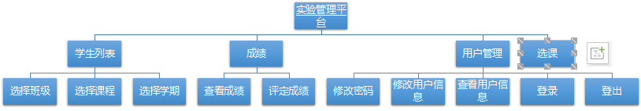
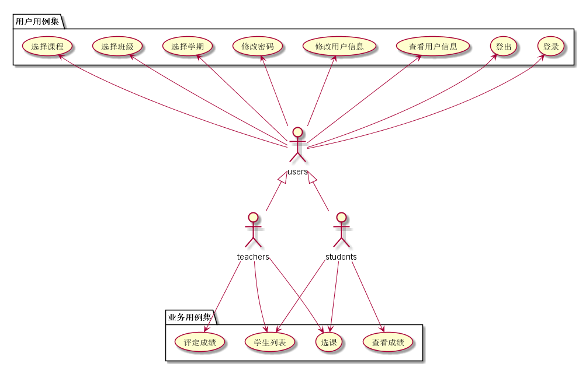
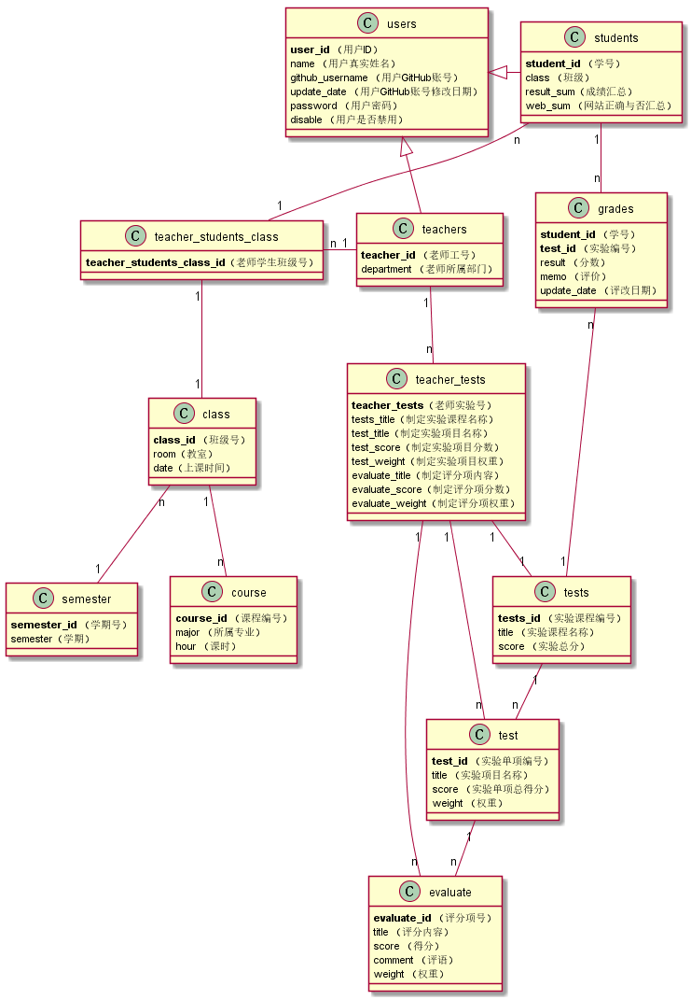

# 实验6（期末考核） 基于GitHub的实验管理平台的分析与设计
| 学号 | 班级 | 姓名 | 照片|
|:----:|:-----:|:----:|:----:|
| 201510414320 | 软件（本）15-3 | 谢超 |  |
## 1.概述
* 基于GitHub的实验管理平台的作用是在线管理实验成绩的Web应用系统。学生和老师的实验内容均存放在GitHUB 页面上。
* 学生，老师登录后都需要选择学期，课程才能找到对应的页面，否则显示全部或者上次登录显示或者不显示。
* 学生的功能主要有：一是设置自己的GitHub用户名，二是查询自己的实验成绩。学生的GitHub用户名是公开的，但成绩不公开。
* 老师的功能主要有：一是批改每个学生的成绩，二是查看每个学生的成绩，三是创建课程供学生选择。
* 老师和学生都能通过本系统的链接方便地跳转到学生的每个GitHub实验目录，以便批改实验或者查看实验情况。
* 实验成绩按数字分数计算，每项实验的满分为100分，最低为0分。
* 系统自动计算每个学生的所有实验的平均分。
## 2.系统总体结构

* 界面设计参见：https://Neddy1995.github.io/is_analysis/test6/ui/index.html
## 3.用例图设计

## 4.类图设计

## 5.数据库设计

* USER表（用户表）

|字段|类型|长度|主键,外键|可否为空|默认值|约束|说明|
|:----:|:-----:|:----:|:----:|:----:|:-----:|:----:|:----:|
|USER_ID|INT|8|主键|否|||用户ID|
|NAME|VARCHAR|256||否|||用户姓名|
|GITHUB_USERNAME|VARCHAR|256||是|空||Github用户名|
|UPDATE_DATE|DATE|||是|空||Github用户名修改时间|
|PASSWORD|VARCHAR|16||是|空||加密存储密码，为空表示密码就是学号|
|DISABLE|VARCHAR|2||否|||是否禁用,值为空是表示禁用,其他表示正常|

* TEACHERS表（老师表）

|字段|类型|长度|主键,外键|可否为空|默认值|约束|说明|
|:----:|:-----:|:----:|:----:|:----:|:-----:|:----:|:----:|
|TEACHER_ID|INT|8|主键|否|||老师的编号|
|USER_ID|INT|8|外键|是|||老师的用户ID，USERS表的外键|
|DEPARTMENT|VARCHAR|256||否|||老师属于的部门|

* STUDENTS表（学生表）

|字段|类型|长度|主键,外键|可否为空|默认值|约束|说明|
|:----:|:-----:|:----:|:----:|:----:|:-----:|:----:|:----:|
|STUDENT_ID|INT|8|主键|否|||学生的学号|
|USER_ID|INT|8|外键|是|空||学生的用户ID，USERS表的外键，为空表示还没有建立用户|
|CLASS|VARCHAR|256||否|||班级属于的部门|
|RESULT_SUM|VARCHAR|256|外键|是|空||成绩汇总（来自GRADES表），以逗号分开，第一个成绩是平均成绩,后面是每次实验的成绩，N表示未批改，平均分只计算已批改的。比如：“81.25,70,80,85,90,N”表示一共批改了4次，第5次未批改，4次的成绩分别是81.25,70,80,85,90,N，4次的平均分是81.25|
|WEB_SUM|VARCHAR|256||是|空||GitHub网址是否正确，用逗号分开，Y代表正确，N代表不正确。第1位代表总的GitHUB地址是否正确，第2位表示第1次实验的地址，第3位表示第2位实验地址，依此类推。比如：“Y,Y,Y,Y,Y,N”表示第5次实验地址不正确，其他地址正确|

* CLASS表（班级表）

|字段|类型|长度|主键,外键|可否为空|默认值|约束|说明|
|:----:|:-----:|:----:|:----:|:----:|:-----:|:----:|:----:|
|CLASS_ID|INT|8|主键|否|||班级ID|
|ROOM|VARCHAR|256||是|空||上课教室|
|DATE|VARCHAR|256||是|空||上课时间|
|SEMESTER_ID|INT|8|外键|是|空||学期号|
|COURSE_ID|INT|8|外键|是|空||课程编号|

* TEACHER_STUDENTS_CLASS表（老师学生课程联合表）

|字段|类型|长度|主键,外键|可否为空|默认值|约束|说明|
|:----:|:-----:|:----:|:----:|:----:|:-----:|:----:|:----:|
|TEACHER_STUDENTS_CLASS_ID|INT|8|主键|否|||老师学生班级编号|
|TEACHER_ID|INT|8|联合主键1，外键|是|空||老师ID|
|COURSE_ID|INT|8|联合主键2，外键|是|空||课程号|
|STUDENTS_ID|INT|8|联合主键3，外键|是|空||学生号|

* COURSE表（课程表）

|字段|类型|长度|主键,外键|可否为空|默认值|约束|说明|
|:----:|:-----:|:----:|:----:|:----:|:-----:|:----:|:----:|
|COURSE_ID|INT|8|主键|否|||课程ID|
|MAJOR|VARCHAR|256||否|||所属专业|
|HOUR|INT|8||否|||课时|

* SEMESTER表（学期表）

|字段|类型|长度|主键,外键|可否为空|默认值|约束|说明|
|:----:|:-----:|:----:|:----:|:----:|:-----:|:----:|:----:|
|SEMESTER_ID|INT|8|主键|否|||学期号|
|SEMESTER|VARCHAR|256||否|||学期|

* GRADES表（学生实验成绩表）

|字段|类型|长度|主键,外键|可否为空|默认值|约束|说明|
|:----:|:-----:|:----:|:----:|:----:|:-----:|:----:|:----:|
|STUDENT_ID|INT|8|联合主键1，外键|否|||学生的学号，STUDENTS表外键|
|TEST_ID|INT|8|联合主键2，外键|否|||实验编号，TESTS表外键|
|RESULT|INT|8|主键|是|空|取值0-100|分数，这个值为空表示没有批改|
|MEMO|VARCHAR|256||是|空||老师对实验的评语|
|UPDATE_DATE|DATE|||是|空||老师批改实验的时间，为空表示为批改|

* TESTS表（实验项目总表）

|字段|类型|长度|主键,外键|可否为空|默认值|约束|说明|
|:----:|:-----:|:----:|:----:|:----:|:-----:|:----:|:----:|
|TESTS_ID|INT|8|主键|否|||实验课程号|
|TITLE|VARCHAR|256||否|||实验名称|
|SCORE|INT|3||是|空|0-100|实验总得分，所有实验的分数按照比例进行计算得出的分数|

* TEST表（单项实验项目表）

|字段|类型|长度|主键,外键|可否为空|默认值|约束|说明|
|:----:|:-----:|:----:|:----:|:----:|:-----:|:----:|:----:|
|TEST_ID|INT|8|主键|否|||实验号|
|TITLE|VARCHAR|256||是|空||实验项目名称|
|SCORE|INT|8||是|空|0-100|实验得分|
|WEIGHT|DOUBLE|3||否||0-1|权重，该实验在整体实验中占有的比例|
|TESTS_ID|INT|8|外键|否||实验课程号|
|TEACHER_TEST_ID|INT|8|外键|否||老师制定实验ID|

* EVALUATE表（评分项表）

|字段|类型|长度|主键,外键|可否为空|默认值|约束|说明|
|:----:|:-----:|:----:|:----:|:----:|:-----:|:----:|:----:|
|EVALUATE_ID|INT|8|主键|否|||评分项ID|
|TITLE|VARCHAR|256||是|空||评分内容|
|SCORE|INT|3||是|空|0-100|评分项得分|
|COMMENT|VARCHAR|256||是|空||老师修改时做的评语|
|WEIGHT|DOUBLE|3||否|||该评分项在这个实验中的比例|
|TEST_ID|INT|8|外键|否|||单项实验的id|
|TEACHER_TESTS_ID|INT|8|外键|否|||老师制定实验ID|

* TEACHER_TESTS表（老师制定实验表）

|字段|类型|长度|主键,外键|可否为空|默认值|约束|说明|
|:----:|:-----:|:----:|:----:|:----:|:-----:|:----:|:----:|
|TEACHER_TESTS_ID|INT|8|主键|否|||老师实验ID|
|TESTS_TITLE|VARCHAR|256||是|空||实验课程名称|
|TEST_TITLE|VARCHAR|256||是|空||实验项目名称|
|TEST_SCORE|INT|3||是|空||实验项目得分|
|TEST_WEIGHT|DOUBLE|3||是|空||实验项目权重|
|EVALUATE_TITLE|VARCHAR|256||是|空||评分项内容|
|EVALUATE_SCORE|INT|3||是|空||评分项得分|
|EVALUATE_WEIGHT|DOUBLE|3||是|空||评分项权重|
## 6.用例及界面详细设计
* ["学生列表"用例](./用例/用例_学生列表.md)，
* ["评定成绩"用例](./用例/用例_评定成绩.md)，
* ["查看成绩"用例](./用例/用例_查看成绩.md)，
* ["修改密码"用例](./用例/用例_修改密码.md)，
* ["修改用户信息"用例](./用例/用例_修改用户信息.md)，
* ["查看用户信息"用例](./用例/用例_查看用户信息.md)，
* ["登出"用例](./用例/用例_登出.md)，
* ["登录"用例](./用例/用例_登录.md)，
* ["选课"用例](./用例/用例_选课.md)，
