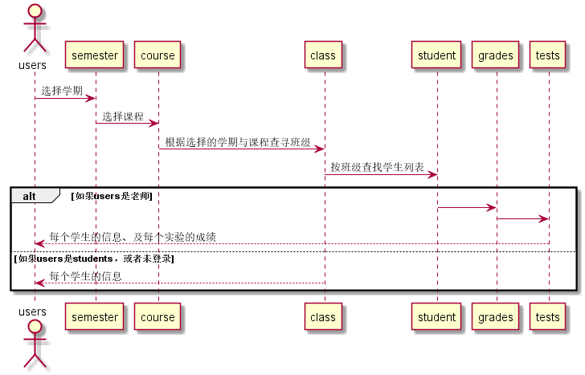

# "学生列表"用例
## 1.用例规约

|用例名称|学生列表|
|:---:|:---:|
|功能|以表的形式显示出当前所选择的学期和课程所有学生的信息|
|参与者|游客，学生，老师|
|前置条件|学生，老师需要登录|
|后置条件||
|主流事件||
|备注||
## 2.业务流程（顺序图）

## 3.界面设计
界面参照:
## 4.算法描述
无
## 5.参照表
* course
* students
* grades
* tests
## API接口