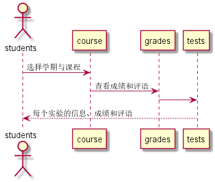

# "查看成绩"用例
## 1.用例规约
|用例名称|查看成绩|
|:---:|:---:|
|功能|学生查看自己的每个实验的实验成绩及实验评价|
|参与者|学生|
|前置条件|学生需要先登录，选择学期及课程|
|后置条件||
|主流事件||
|备注||
## 2.业务流程（顺序图）

## 3.界面设计
界面参照:
## 4.算法描述
无
## 5.参照表
* course
* students
* grades
* tests
## API接口