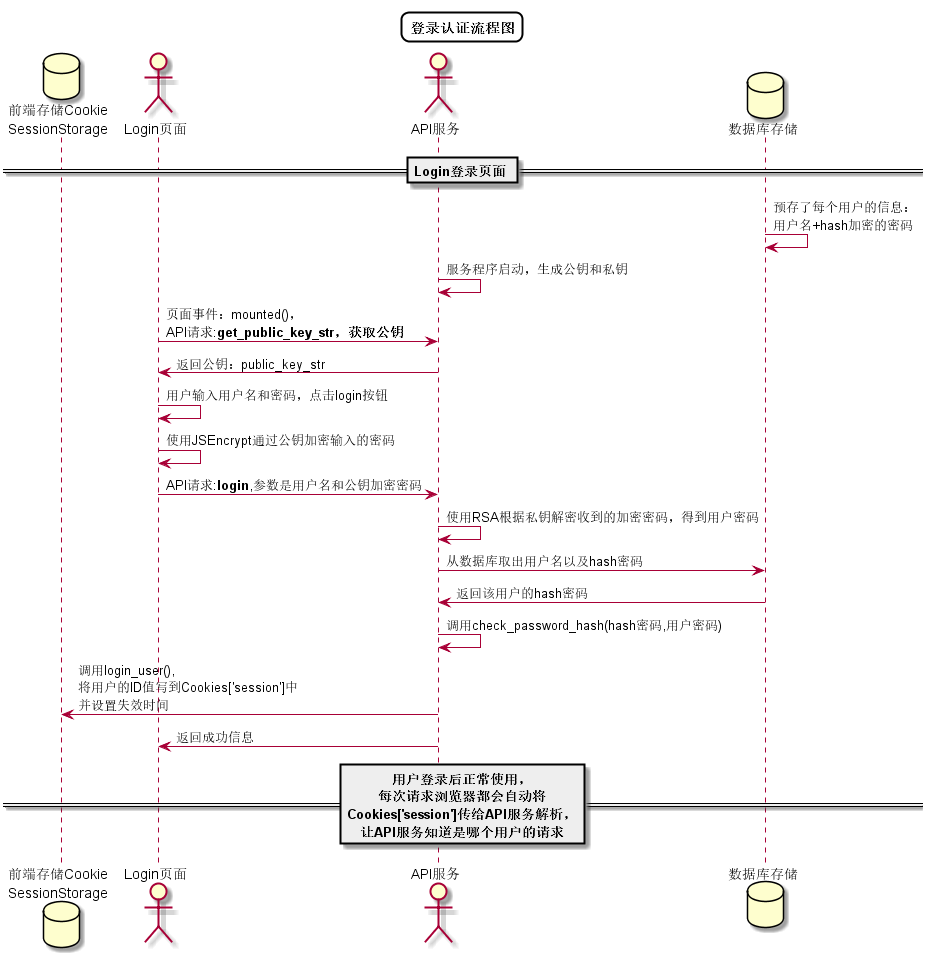

# "登录"用例
## 1.用例规约
|用例名称|登录|
|:---:|:---:|
|功能|登录平台|
|参与者|访客|
|前置条件||
|后置条件|登录成功后，跳转到主页|
|主流事件|1. 访客输入用户名和密码，选择用户类型 2.系统判断用户名，密码，用户类正确，允许登录 3.系统在客户端以Cookie形式存储登录用户信息，保持登录的持久性。|
|备选事件流|1a. 输入的用户名或者密码为空 1.提示重新输入 2.访客重新提交登录信息 2a.系统判断用户名，密码，用户类不正确，不允许登录 1.提示重新输入 2.访客重新提交登录信息|
## 2.业务流程（顺序图）
无
## 3.界面设计
界面参照:
## 4.算法描述

## 5.参考表
* [users](../README.md)
## 6.API接口
[login](../接口/login.md)