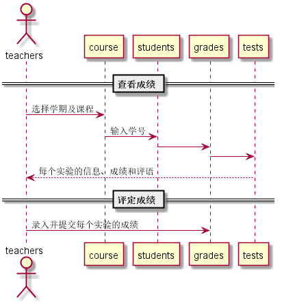

# "评定成绩"用例
## 1.用例规约

|用例名称|评定成绩|
|:---:|:---:|
|功能|老师评定一个学生的实验成绩|
|参与者|老师|
|前置条件|查看成绩：评定成绩之前，老师需要先登录，并显示出一个学生的所有实成绩和评语|
|后置条件|评定成绩提交之后，系统自动设置成绩更新日期为当前日期，自动计算平均成绩|
|主流事件|评定成绩|
|备注||
## 2.业务流程（顺序图）

## 3.界面设计
界面参照:
## 4.算法描述
无
## 5.参照表
* course
* studnets
* grades
* tests
## API接口