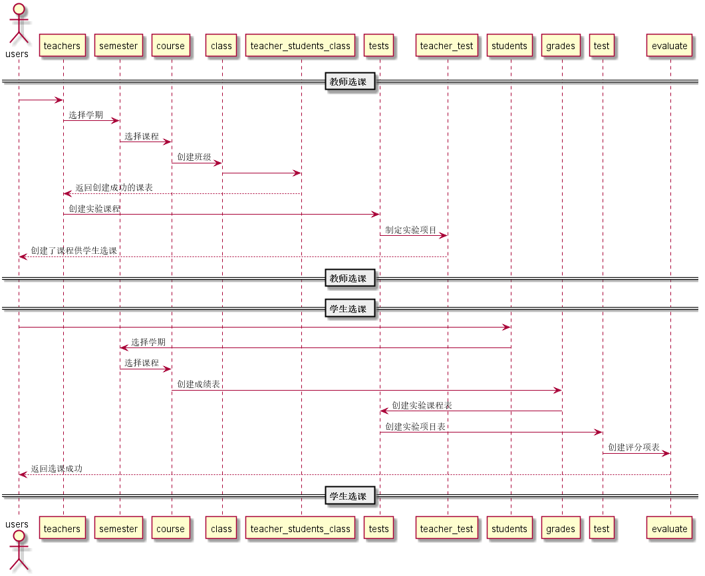

# "选课"用例
## 1.用例规约
|用例名称|修改用户信息|
|:---:|:---:|
|功能|选课|
|参与者|学生,老师|
|前置条件|必须先登录，老师先选择，学生后选择|
|后置条件|选择课程后才能有该课程的实验项目|
|主流事件|3|
|备注||
## 2.业务流程（顺序图）

## 3.界面设计
界面参照:
## 4.算法描述
无
## 5.参照表
* [users](../README.md)
* [teachers](../README.md)
* [students](../README.md)
* [teacher_students_class](../README.md)
* [semester](../README.md)
* [class](../README.md)
* [course](../README.md)
* [teacher_test](../README.md)
* [grades](../README.md)
* [tests](../README.md)
* [test](../README.md)
* [evaluate](../README.md)

## 6.API接口
[teacherChoose](../接口/teacherChoose.md)
[studentChoose](../接口/studentChoose.md)